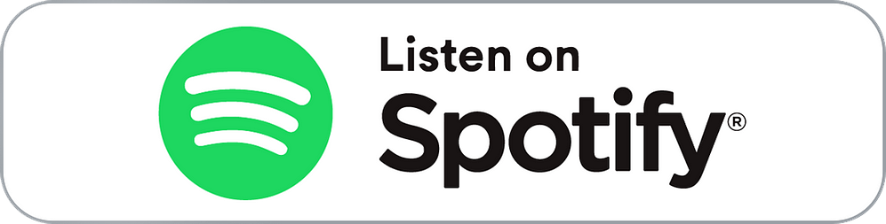

 

&nbsp;

---

## 🎵 Currently Listening

  

---

## 🛠 Tech DNA

> *"The right tool for the right platform. Native or nothing."*

 

<b>🔬 Full stack breakdown</b>

 

| Domain | Stack |
|:-------|:------|
| 🍎 Native macOS / iOS | Swift · AppKit · UIKit · SwiftUI |
| 🌐 Web (when the OS demands it) | TypeScript · React · Vite · Tailwind CSS |
| 🐳 Infrastructure | Docker · Nginx · Ansible |
| 🔍 Reverse engineering | IDA Pro |
| 🔧 Daily tools | Xcode · VS Code · IDA |

---

## ⚡ A Few Things About Me

- 🍎 Running on Apple Silicon — native arm64, no emulation, no compromises
- ⚙️ Performance obsessive.
- 🎛️ Convinced the best UI framework is the one shipped with the OS.
- 🌙 Dark mode everywhere, always. Non-negotiable.
- 🎵 Music is always on.
- 🤝 Open source contributor.

---

## 📊 Stats

 

 

 

---

