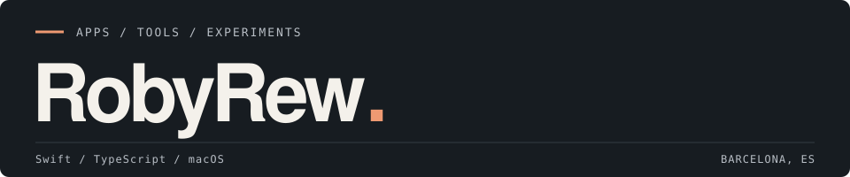

I build native apps and practical web tools. I care about fast startup, low memory use, and interfaces that feel at home on the platform.

Most of my native work is **Swift, SwiftUI and AppKit** on macOS. For the web, I work with **TypeScript and React**, with **Docker and Ansible** behind the scenes. I also enjoy reverse engineering and getting hardware to do things it wasn't meant to.

### Selected projects

**[TopPresenter](https://github.com/RobyRew/TopPresenter)** · SwiftUI / SwiftData 
A native Mac app for putting scripture, lyrics and slides on a projector.

**[PeaceTimer](https://github.com/RobyRew/pacetimer)** · SwiftUI / AppKit 
A Mac menu-bar countdown you set by dragging, with haptics and sleep prevention.

**[CalGen](https://github.com/RobyRew/calendar-event-generator)** · [Open app ↗](https://robyrew.github.io/calendar-event-generator/) 
Create, edit and export calendar events. Everything stays in the browser.

**[PowerPoint Extractor](https://github.com/RobyRew/powerpoint-extractor)** · [Open app ↗](https://robyrew.github.io/powerpoint-extractor/) 
Get text, images and notes out of PowerPoint files, locally in your browser.

**[MapSwitch](https://github.com/RobyRew/mapswitch)** 
Open a shared map link in the maps app you actually use.

**[ChatForge](https://github.com/RobyRew/chatforge)** 
Convert WhatsApp and Telegram chat exports between formats.

Other rabbit holes: [Nokia firmware and ringtones](https://github.com/RobyRew/retro-phone-tools), [per-app SSH tunnels](https://github.com/RobyRew/split-stream), and my [older, archived Hackintosh guides](https://github.com/RobyRew?tab=repositories&q=Hackintosh).

### Open source

<a href="https://github.com/RobyRew?tab=repositories">
  <picture>
    <source media="(max-width: 480px)" srcset="https://raw.githubusercontent.com/RobyRew/RobyRew/profile-assets/stats-compact.svg">
    
  </picture>
</a>

### Usually with music on

<a href="https://open.spotify.com/user/gwiw7i4a2ha0a8dbldyn94vwl">
  <picture>
    <source media="(max-width: 480px)" srcset="https://raw.githubusercontent.com/RobyRew/RobyRew/profile-assets/spotify-compact.svg">
    
  </picture>
</a>

Listening snapshots refresh hourly; the capture time is shown when a track is available.

---

[Telegram](https://t.me/RobyRew) · [Spotify](https://open.spotify.com/user/gwiw7i4a2ha0a8dbldyn94vwl) · [All repositories](https://github.com/RobyRew?tab=repositories)
